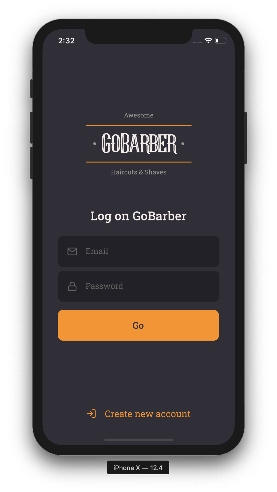
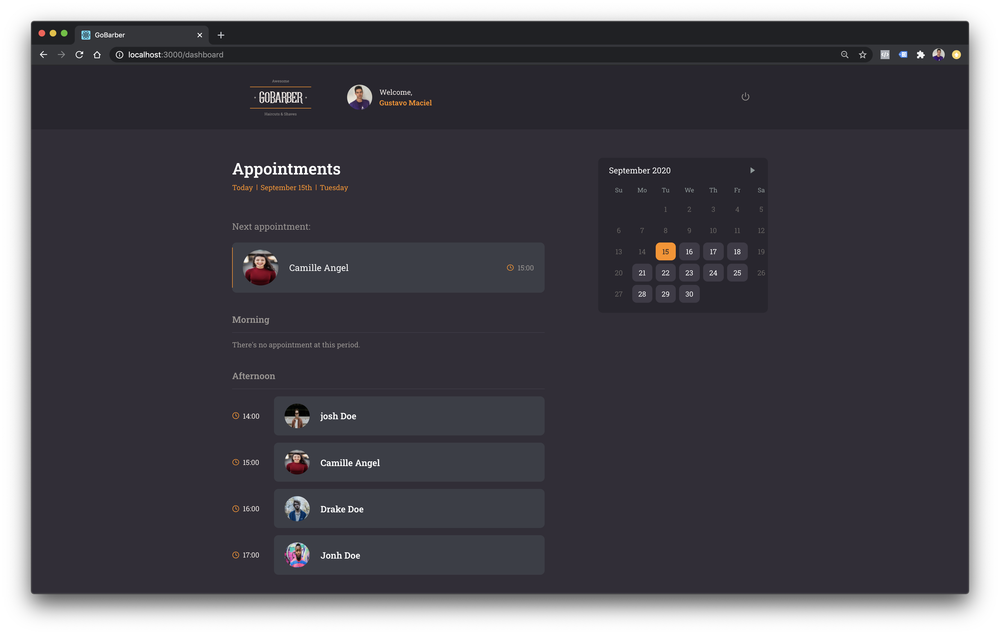
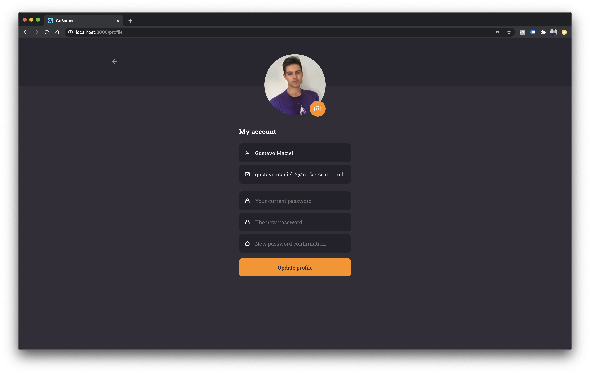

  

# GoBarber Web
Através da aplicação Web, o prestador de serviço consegue visualizar os agendamentos realizados pelos seus clientes.

  
  
  

  
  

# Tecnologias utilizadas
- React
- TypeScript
- axios
- date-fns
- styled-components
- react-native-community/datetimepicker

# Funcionalidades
- Login e cadastro
- Listagem de agendamentos por dia
- Atualização de perfil
- Recuperação de senha
