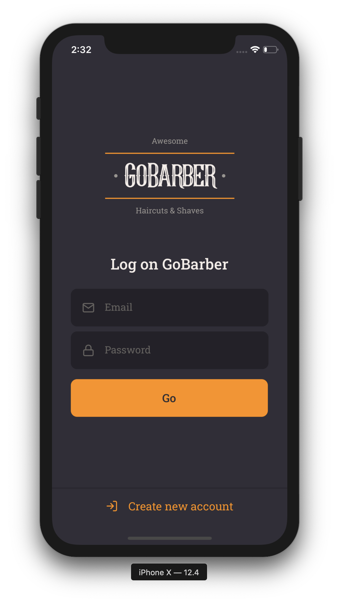

  

# GoBarber Mobile
Através da aplicação Mobile, o usuário consegue visualizar os artistas disponíveis (prestadores de serviços de beleza), os horários disponíveis e fazer um agendamento.

  
  
  

  
  
  

# Tecnologias utilizadas
- React Native
- TypeScript
- axios
- date-fns
- react-nativigation/native
- react-native-community/async-storage
- styled-components
- react-native-community/datetimepicker

# Funcionalidades
- Login e cadastro de clientes
- Listagem de prestadores de serviço
- Listagem de agendamentos
- Criação de agendamentos
- Atualização de perfil
